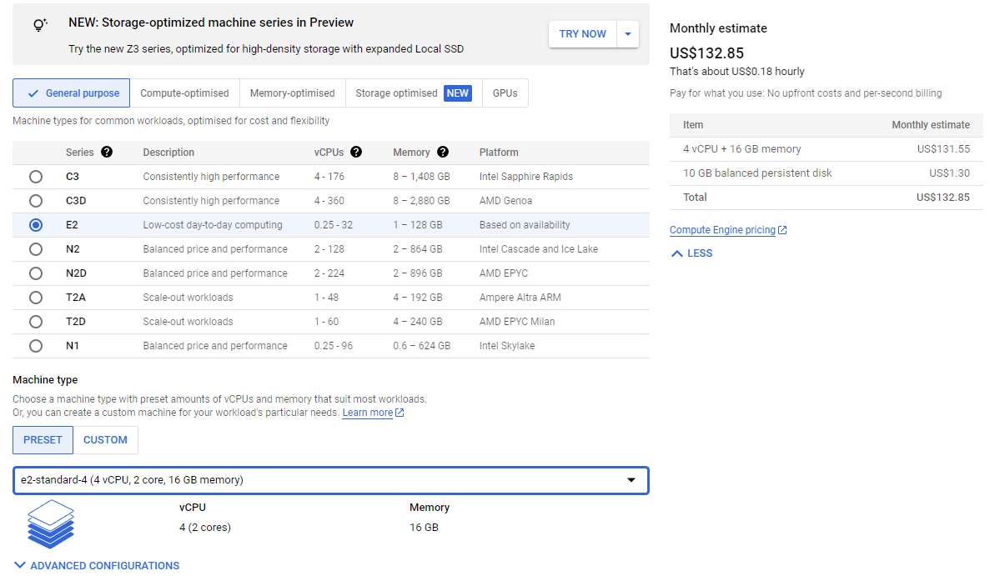
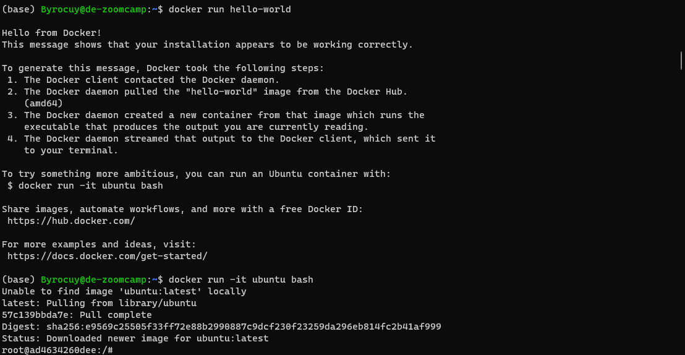
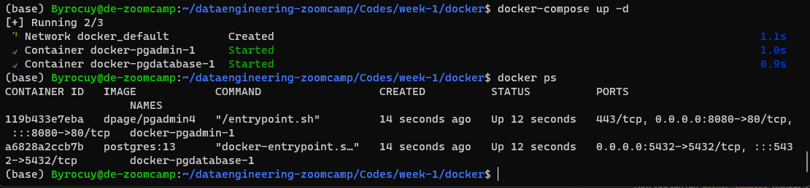
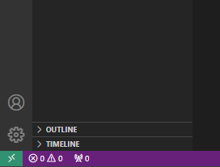
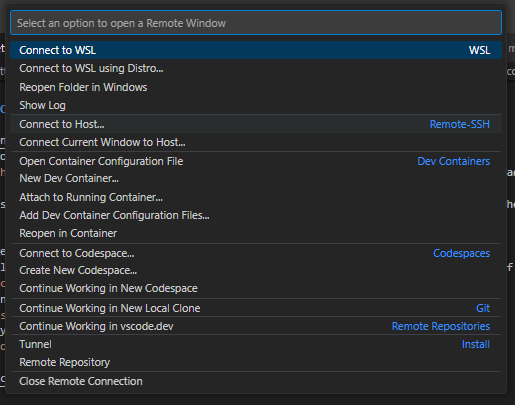
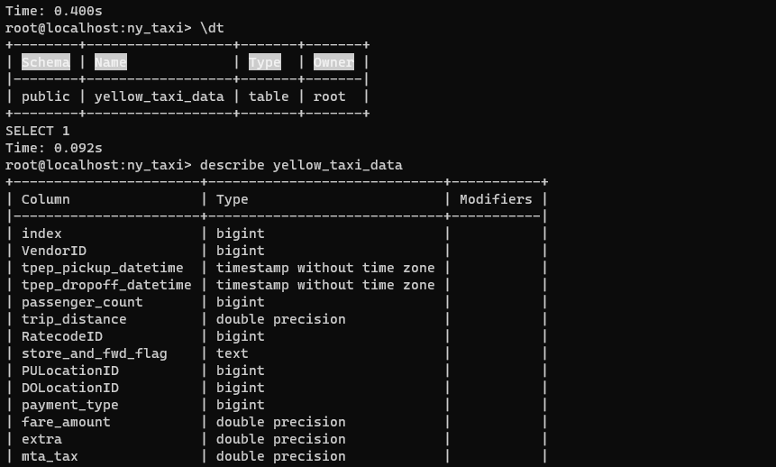

# 1.4. Setting Up the Environment
▶️ [Video](https://www.youtube.com/watch?v=ae-CV2KfoN0&list=PL3MmuxUbc_hJed7dXYoJw8DoCuVHhGEQb&index=15)

## 1.4.1. Setting Up the Environment on Google Cloud (Cloud VM + SSH Access)
### Creating and Connecting to a VM Instance 
- First, we are going to upload our SSH key to the Google Cloud. This is the key that we will use to access the VM. Go to GCP Console, then go to Compute Engine (Enable API if it's your first time) > Metadata > SSH Keys. Add your SSH key there. 
    - If you don't have one, you can generate one using `ssh-keygen` command in your terminal. [[See instructions here](https://cloud.google.com/compute/docs/connect/create-ssh-keys)].
    - If you have already generated ssh, you can find the public key in `~/.ssh/` directory. The public key is the one with `.pub` extension. In terminal, you can use `cat ~/.ssh/id_rsa.pub` to show the public key. Copy it and paste it in the SSH Keys section in GCP Console.
- Next, create a new VM instances. Go to Compute Engine > VM Instances > Create. 
    - Give it a name, example: `de-zoomcamp`
    - Choose the region and zone that closest to you.
    - Choose the machine type, for this project, we will use `e2-standard-4 (4 vCPU, 2 core, 16 GB memory)`  

        

    - Choose the boot disk, for this project, we will use `Ubuntu 20.04 LTS`. Change the disk size to 30GB.
    - leave everything else as default and click `Create`.

    💡 `Note: you also can see the equivalent code to create these resource with CLI or Terraform`

- After the VM is created, you can connect to the VM using SSH in your terminal
    - Copy the external IP of the VM created and run `ssh -i path/to/ssh name@external-ip` in your terminal. example: `ssh -i ~/.ssh/id_rsa byrocuy@34.152.153.103`
        - If succesfull, you will be connected to the VM and you can see the terminal prompt changed to the VM name. 
        - run `htop` to see the resource usage and `gcloud --version` to see gcloud SDK installed.
    - For shortcut, we can add the VM to a config file so we don't need to type the IP address everytime we want to connect to the VM.
        - Create `config` file in `.ssh` directory. For example you can create it using `touch ~/.ssh/config` and add following code in the file:

        ```bash
        Host de-zoomcamp # This is the shorthand name for connecting to the VM
            HostName 34.152.153.104 # External IP of the VM 
            User Byrocuy # Username to connect to the VM
            IdentityFile ~/.ssh/id_rsa # Absoulte path to the SSH key
        ```

        - Save it. Now to connect to the VM, simply run `ssh de-zoomcamp` in your terminal.

### Installing Anaconda, Docker, and Docker Compose
Installing Anaconda:
- Go to [Anaconda website](https://www.anaconda.com/download) and copy the link installer for Linux.
- Run `wget link-to-anaconda-installer` in your terminal to download the installer
- Run `bash Anaconda3-2021.05-Linux-x86_64.sh` to install Anaconda. Replace the file name with the downloaded file name. Read the license and type `yes` to continue the installation. Leave everything else as default. type `yes` to add Anaconda to PATH.
- Logout and login again to apply the changes. Run `conda --version` to check if Anaconda is installed or run `python` to check if Anaconda Python is installed.

Installing Docker:
- Run `sudo apt update` to update the package list
- Run `sudo apt install docker.io` to install Docker. After the installation is complete, run `docker --version` to check if Docker is installed.
- Now you want to test docker by running `docker run hello-world`, but you can't because the permission is denied. 
    - To solve this, run the following command:
    - run `sudo groupadd docker`, then run `sudo gpasswd -a $USER docker`, and finally run `sudo service docker restart`
    - logout from VM and login again to apply changes.
    - now run `docker run hello-world` or `docker run -it ubuntu bash`.

    

Installing Docker Compose:
- Go to Docker Compose Github page [here](https://github.com/docker/compose/releases/), choose the latest stable release and copy the download link for `linux x86-64`.
- In the VM terminal, create `bin` directory using `mkdir bin`, `cd` to `bin`, and run `wget http://link-here -O docker-compose`
- Run `chmod +x docker-compose` to make the file executable. But everytime you want to run docker-compose, you still need to refer `./bin/docker-compose`
- To run without refer `./bin`, edit `.bashrc` file by running `nano .bashrc` and add in the end of the file `export PATH="${HOME}/bin:${PATH}"`, save it and run `source .bashrc` to apply changes without relogin.
- Now you can run `docker-compose` without `./bin`. Run `docker-compose --version` to verify the installation.
- Clone [Data engineering zoomcamp repository](https://github.com/DataTalksClub/data-engineering-zoomcamp.git), run `git clone https://github.com/DataTalksClub/data-engineering-zoomcamp.git`
- cd to the week 1 docker modules and run `docker-compose up -d`, it will running `pgadmin` and `pgdatabase` we have created in the second module. 



- check the running docker with `docker ps`

Install PGCLI:
- Run `pip install pgcli`
- Run pgcli, `pgcli -h localhost -p 5432 -u root -d ny_taxi`
- Run `\dt` command in the pgcli shell. It will show none because we haven't any table yet.

### Setting Up Visual Studio Code for Remote SSH Connection
- Open Visual Studio Code, install `Remote - SSH` extension if you haven't. 
- Click the green icon on the bottom left corner like pic below. Click `Connect to a Host (Remote-SSH)` and choose de-zoomcamp. 





- A new window will appear, choose linux environment and continue. If you facing error while connecting to SSH, [see it this helped](#cannot-connect-visual-studio-code-to-remote-ssh)

Now, we want to access the pgdatabase and pgadmin in our local machine. We can do this by port forwarding. 
- Open terminal in Visual Studio Code by clicking `Terminal` > `New Terminal`
- Click `Port` tab and `Add Port`. Add `5432` and `8080` ports.
- Now try connecting pgcli `pgcli -h localhost -p 5432 -u root -d ny_taxi` in your local terminal and pgadmin in your browser `localhost:8080`.

### Create table schema from Jupyter Notebook
Now we will test to make a schema in our VM database from Jupyter Notebook.
- start notebook from the terminal using `jupyter notebook`
- head to the docker directory and open `upload_data.ipynb`
- Check the engine connection by running the `engine.connect()`
- Run the cells till `df.head(n=0).to_sql...`
- Check the database with pgcli or pgadmin to see if there si table we just created



### Running Terraform in GCP

First thing we need do is installing Terraform:
- head to Terraform website and download the bin file for linux using `wget` in the terminal
- copy and unzip it in `bin` directory
- the `terraform` command can be used anywhere because we already have added '`bin` directory in `.bashrc`. Check it by running `terraform --version`.

Next, we need to copy our `service account.json` from local machine to our VM. We will use SFTP to transfer files from local to our remote host:
- head to the directory where you store `service account.json`, and run `sftp de-zoomcamp` command to connect to remote host
- create `.gc` directory in the home by running `mkdir .gc`
- change directory to `.gc` and copy the `service account.json` to `.gc` using `put service account.json .` command

Now we need to activate service account key to the gcloud CLI:
- in the terminal, run `export GOOGLE_APPLICATION_CREDENTIALS=~/.gc/your-service-account.json` and run `gcloud auth activate-service-account --key-file $GOOGLE_APPLICATION_CREDENTIALS`. If it's succesfull, there will be output the service account has been activated

Now we can build the terraform project:
- head to the terraform directory in your remote machine and run `terraform init` and `terraform plan`. If you see error like:
```
Error: Invalid function argument
│
│   on main.tf line 11, in provider "google":
│   11:   credentials = file(var.credentials)
│     ├────────────────
│     │ while calling file(path)
│     │ var.credentials is "./serviceaccount-375210-190269feacba.json"
```
it's happened because we don't have our `service account.json` in that directory. Actually, because we already have activated the service account, we don't need to add credential in our `main.tf` file. So, head to `main.tf` and simply delete the `credentials` line under `provider "google"`


## 1.4.2. Using Github Codespaces for the Course
## 1.4.3. Port Mapping and Networks in Docker

# Some Errors I Encountered and the Solutions
## Cannot connect Visual Studio Code to Remote SSH
Solution: Check if the config file used in visual studio code is the same as the config file used in the terminal. 
- In my case, I have two config files, one in `~/.ssh/config` (used in WSL terminal) and one in `C:\Users\{User}\.ssh\config` (in Windows) with different content. I have to copy the content of the first config file used in terminal at `~/.ssh/config` to the Windows ssh directory.
- Edit the `config` file in Windows ssh directory and change the `IdentityFile` to ssh windows absolute path, example: `C:\Users\Byrocuy\.ssh\config`.

<div align="center">

###  [<< 1.3. Terraform Basics](./3-terraform-basics.md) | [Home](README.md) 

</div>