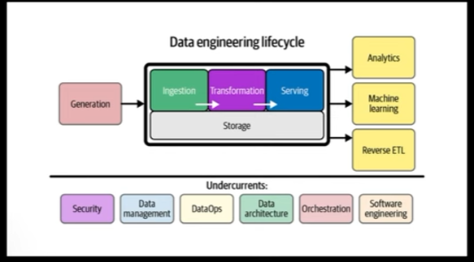

# 2.1. What is Orchestration

Orchestration is the process of automating and coordinating multiple tasks to achieve a desired outcome. In the context of data engineering, orchestration is the process of automating and coordinating the execution of data pipelines.

orchestrator handles:
- workflow management
- automation
- Error handling
- Recovery
- Monitoring and alerting
- Resource optimization
- Observability
- Debugging
- Compliance/Auditing

## 