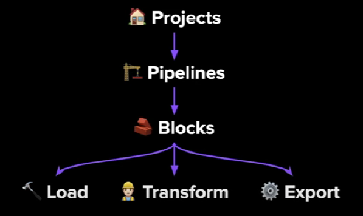

# 2.2 Intro to Mage

## 2.2.1 What is Mage
an open-source pipeline tool for orchestrating, transforming, and monitoring data.



- projects: homebase
- pipelines: a series of tasks or workflow
    - workflow that executes some data operation, kind of DAGs
    - pipelines can contain Blocks (written in SQL, Python, or R) and charts
    - represented by a YAML file
- blocks: atomic unit of transformation in Mage -> Extract, Transform, Load (ETL)
    - files that can be executed independently or within a pipeline
    - blocks -> Directed Acyclic Graphs (DAGs) -> pipelines
    - reusable

Advantage:
- support hyrid environment
    - use Mage GUI or other IDEs for interactive development, VSCode for example
    - it use `blocks` as a testable and reusable pieces of code
- improved developer experience
    - code and test in parallel
    - reduce yoru dependencies, switch tool less, be efficient 

## 2.2.2 Configuring Mage

We will setting up Mage on our local machine. 
- First, clone Mage zoomcamp repository [here](https://github.com/mage-ai/mage-zoomcamp)
- `cd` to the cloned directory and rename `dev.env` file to just `.env` (without the `dev` prefix)
- Run `docker-compose build` to build the docker image and start the container using `docker-compose up` command
- Open your browser and go to `http://localhost:6789` to acces the Mage instance.

## 2.2.3 Configuring Postgres in Mage
We will configure a Postgres connection in Mage. In Mage, we actually already have default config to connect to a Postgres database, we can see it in our project folder in `io_config.yaml` file. There is `default` profile where it has bunch of different database configurations, like MongoDB, MySQL, Azure, AWS, including PostgreSQL. 

We will create a new profile for our simple Postgres connection.
- Edit `io_config.yaml` file (you can do it in your IDE or in Mage GUI), and at the bottom of the file, add a new profile `dev` for our Postgres connection:

```yaml
dev:
  POSTGRES_CONNECT_TIMEOUT: 10
  POSTGRES_DBNAME: "{{ env_var('POSTGRES_DBNAME') }}"
  POSTGRES_SCHEMA: "{{ env_var('POSTGRES_SCHEMA') }}"
  POSTGRES_USER: "{{ env_var('POSTGRES_USER') }}"
  POSTGRES_PASSWORD: "{{ env_var('POSTGRES_PASSWORD') }}"
  POSTGRES_HOST: "{{ env_var('POSTGRES_HOST') }}"
  POSTGRES_PORT: "{{ env_var('POSTGRES_PORT') }}"
```

- Save the file and go to Mage GUI, create a new pipeline > choose `Standard (batch)`
- Create a new Data Loader block and choose SQL, name it `postgres-test`
- In the created block, change the `connection` to `PostgreSQL`, and change `deafult` to the `dev` profile. 
    _Note: If you don't see any connection, wait for a few seconds and refresh the page_
- Write following query to test the connection:
```sql
SELECT 1;
```
