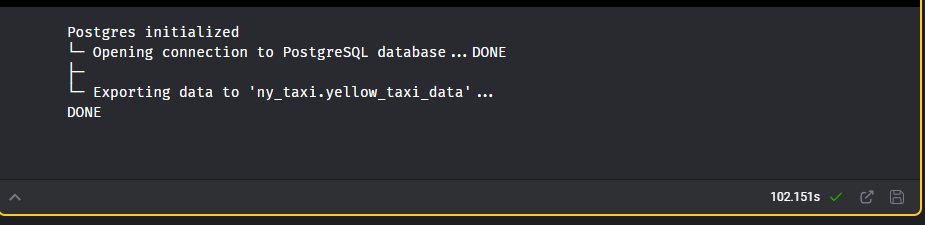
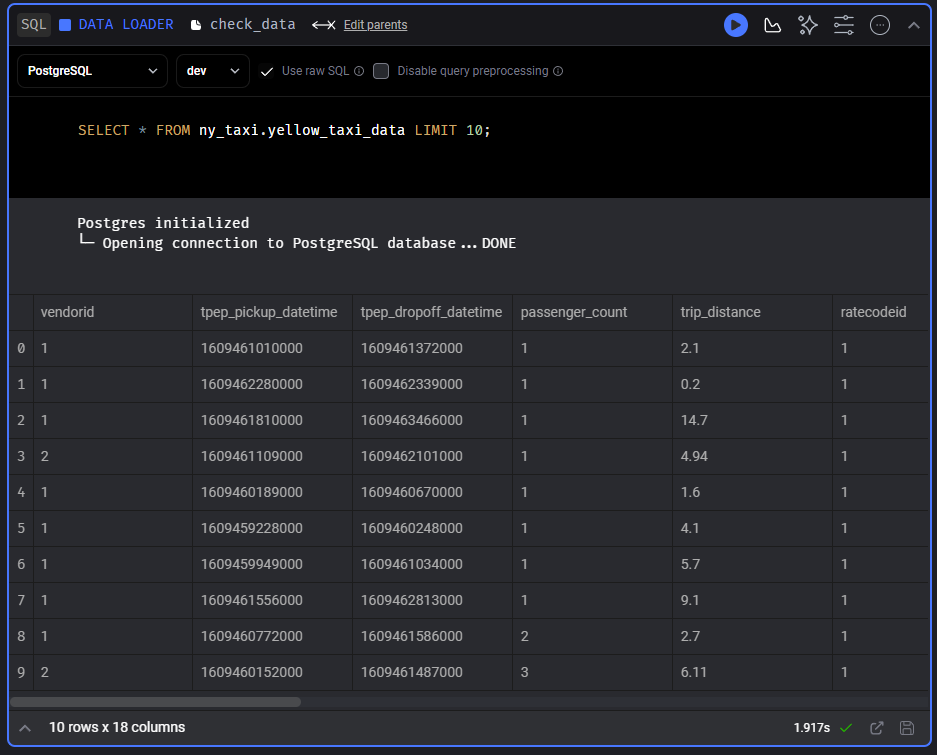

# 2.2 Intro to Mage

## Table of Contents
- [2.2 Intro to Mage](#22-intro-to-mage)
  - [Table of Contents](#table-of-contents)
  - [2.2.1 What is Mage](#221-what-is-mage)
  - [2.2.2 Configuring Mage](#222-configuring-mage)
  - [2.2.3 Configuring Postgres in Mage and ETL API to Postgres](#223-configuring-postgres-in-mage-and-etl-api-to-postgres)
- [Some Errors I Encountered and the Solutions](#some-errors-i-encountered-and-the-solutions)

## 2.2.1 What is Mage
an open-source pipeline tool for orchestrating, transforming, and monitoring data.


- projects: homebase
- pipelines: a series of tasks or workflow
    - workflow that executes some data operation, kind of DAGs
    - pipelines can contain Blocks (written in SQL, Python, or R) and charts
    - represented by a YAML file
- blocks: atomic unit of transformation in Mage -> Extract, Transform, Load (ETL)
    - files that can be executed independently or within a pipeline
    - blocks -> Directed Acyclic Graphs (DAGs) -> pipelines
    - reusable

Advantage:
- support hyrid environment
    - use Mage GUI or other IDEs for interactive development, VSCode for example
    - it use `blocks` as a testable and reusable pieces of code
- improved developer experience
    - code and test in parallel
    - reduce yoru dependencies, switch tool less, be efficient 

## 2.2.2 Configuring Mage

We will setting up Mage on our local machine. 
- First, clone Mage zoomcamp repository [here](https://github.com/mage-ai/mage-zoomcamp)
- `cd` to the cloned directory and rename `dev.env` file to just `.env` (without the `dev` prefix)
- Run `docker-compose build` to build the docker image and start the container using `docker-compose up` command
- Open your browser and go to `http://localhost:6789` to acces the Mage instance.

## 2.2.3 Configuring Postgres in Mage and ETL API to Postgres
We will configure a Postgres connection in Mage. In Mage, we actually already have default config to connect to a Postgres database, we can see it in our project folder in `io_config.yaml` file. There is `default` profile where it has bunch of different database configurations, like MongoDB, MySQL, Azure, AWS, including PostgreSQL. 

We will create a new profile for our simple Postgres connection.
- Edit `io_config.yaml` file (you can do it in your IDE or in Mage GUI), and at the bottom of the file, add a new profile `dev` for our Postgres connection:

```yaml
dev:
  POSTGRES_CONNECT_TIMEOUT: 10
  POSTGRES_DBNAME: "{{ env_var('POSTGRES_DBNAME') }}"
  POSTGRES_SCHEMA: "{{ env_var('POSTGRES_SCHEMA') }}"
  POSTGRES_USER: "{{ env_var('POSTGRES_USER') }}"
  POSTGRES_PASSWORD: "{{ env_var('POSTGRES_PASSWORD') }}"
  POSTGRES_HOST: "{{ env_var('POSTGRES_HOST') }}"
  POSTGRES_PORT: "{{ env_var('POSTGRES_PORT') }}"
```

- Save the file and go to Mage GUI, create a new pipeline > choose `Standard (batch)`
- Create a new Data Loader block and choose SQL, name it `postgres-test`
- In the created block, change the `connection` to `PostgreSQL`, and change `deafult` to the `dev` profile. 
    _Note: If you don't see any connection, wait for a few seconds and refresh the page_
- Write following query to test the connection:
```sql
SELECT 1;
```

Now we will try loading data from an API, transform it, and load it to our Postgres database. 

- We will create a new `standard (batch)` pipeline and name it as `api_to_postgres`.
- Create a new Data Loader block and choose Python > API
- Now we will write Python code to load the data from URL and cast the columns to appropriate data types as we read it. It is important and a good practice in data engineering to cast our data types properly to ensure that the data is loaded correctly and it will efficiently use the storage.

    In the `load_data_from_api` function, write the following code:

    ```python
    url = "https://github.com/DataTalksClub/nyc-tlc-data/releases/download/yellow/yellow_tripdata_2019-01.csv.gz"

    taxi_dtypes = {
        'VendorID': pd.Int64Dtype(),
        'passenger_count': pd.Int64Dtype(),
        'trip_distance': float,
        'RatecodeID': pd.Int64Dtype(),
        'store_and_fwd_flag': str,
        'PULocationID': pd.Int64Dtype(),
        'DOLocationID': pd.Int64Dtype(),
        'payment_type': pd.Int64Dtype(),
        'fare_amount': float,
        'extra': float,
        'mta_tax': float,
        'tip_amount': float,
        'tolls_amount': float,
        'improvement_surcharge': float,
        'total_amount': float,
        'congestion_surcharge': float
    }

    # Parse columns as datetime data type
    parse_dates = ["tpep_pickup_datetime", "tpep_dropoff_datetime"]

    return pd.read_csv(url, 
                    sep=",",
                    compression="gzip", # Pandas will automatically decompress the gzip file
                    dtype=taxi_dtypes, # we specify the data types for each column we have defined
                    parse_dates=parse_dates)

    ```
    Run the block and check the output.

- Now we can do some transformation to the data, for example we will remove rows with `passenger_count` = 0. Add a Transformer block below the data loader. And add the code below to the `transform` function:
    ```python
    print(f"Rows with zero passengers: {data['passenger_count'].isin([0]).sum()}")

    return data[data['passenger_count'] > 0]
    ```

- It's also nice if we have tests for the transformation block. Add the following code below the `transform` function:

    ```python
    @test
    def test_output(output, *args) -> None:
        assert output['passenger_count'].isin([0]).sum() == 0, "There are rows with zero passengers"
    ```
- For the final step, we will end this entire pipeline by loading the data to our Postgres database. Add a `Data exporter` block. Choose Python > PostgreSQL. for this example, name it as `taxi_data_to_postgres`, There will be a template code for you to fill in the connection details and the table name. Edit the code to the following:

    ```python
    schema_name = "ny_taxi"
    table_name = "yellow_taxi_data"
    config_path = path.join(get_repo_path(), 'io_config.yaml')
    config_profile = "dev"
    ```

    Run the block and check the output.

    

- You can check if the data has been loaded to the database using `Data loader` block, choose PostgreSQL and dev profile with `Use raw SQL` checked. and write the following query:

    ```sql
    SELECT * FROM ny_taxi.yellow_taxi_data LIMIT 10;
    ```
    ! Important: Take note we are calling the table name with the schema name beforehand.

    

# Some Errors I Encountered and the Solutions
- When I run the blocks in the pipeline, it occasionally just keep running without any output. I tried to refresh the page but it didn't work. 
    - Solution: I just need to restart the docker compose and it works again. But it's a bit annoying to do it every time it happens. I think it's because of the memory issue, I need to allocate more memory to the docker.