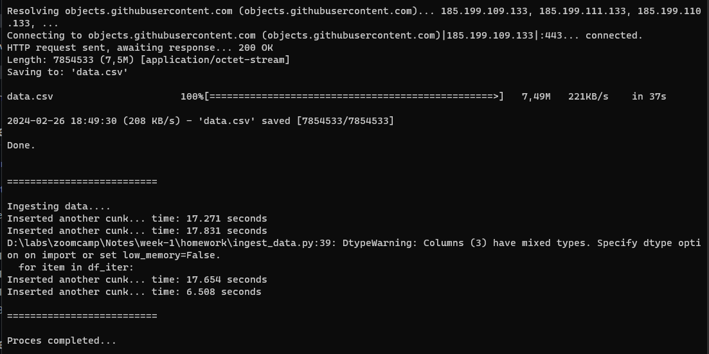

# Module 1 Homework

## 1. Docker & SQL
### Q1: Knowing Docker Tags

Instructions:
- Run the command `docker --help`
- Run the command `docker build --help`
- Run the command `docker run --help`

Questions:
Which tag has the following text? "Automatically remove the container when it exits"

Answer: 
`--rm`

### Q2: Understanding Docker First Run
Instructions:
- Run docker with the python:3.9 image in an interactive mode and the entrypoint of bash. Now check the python modules that are installed (using `pip list`)

Questions:
- What is the version of the package `wheel`?

Answer:
`0.42.0`

## 2. Preparing Postgres

Instructions:
- Ingest the `green_tripdata_2019-09.csv.gz` [[link]](https://github.com/DataTalksClub/nyc-tlc-data/releases/download/green/green_tripdata_2019-09.csv.gz) to Postgres database using Jupyter Notebook or with a pipeline.

In this note, we will use Python pipeline to prepare the data using the same `pipeline.py` file used in this week's lesson. There are some changes needed in the code:
- When reading the csv using `pd.read_csv`, we need to specify the `compression` parameter to `gzip` because the file we are going to download is in gzip format.
- Change the parse dates from `tpep_pickup_datetime` and `tpep_dropoff_datetime` to `lpep_pickup_datetime` and `lpep_dropoff_datetime` because the column names are different in the `green_tripdata_2019-09.csv.gz` file.
- You can leave the rest of the code as is.

After the pipeline is created, run the following command to ingest the data to Postgres (don't forget to start the Postgres server first, you can use `docker-compose up` to start the Postgres server and pgAdmin):

```bash
python ingest_data.py ^
    --username root ^
    --password root ^
    --host localhost ^
    --port 5432 ^
    --db ny_taxi ^
    --table_name green_tripdata ^
    --url https://github.com/DataTalksClub/nyc-tlc-data/releases/download/green/green_tripdata_2019-09.csv.gz
```


### Q3: Count Records

Question:
- How many trips were totally made on September 18th 2019?
Tip: started and finished on 2019-09-18. Remember that `lpep_pickup_datetime` and `lpep_dropoff_datetime` column are in the format timestamp (date and hour+min+sec) and not in date.

Answer:
We can query this using the following SQL query:
```sql
SELECT COUNT(*) AS count_dropoff
FROM green_tripdata
WHERE TO_DATE("lpep_dropoff_datetime", 'YYYY-MM-DD') = '2019-09-18'
AND TO_DATE("lpep_pickup_datetime", 'YYYY-MM-DD') = '2019-09-18'
```

Resulting: 15.612 records count

### Q4: Longest Trip for each Day

Question:
Which was the pick up day with the longest trip distance? Use the pickup time for you calulations
Tip: for every trip on a single day, we only care about the trip with the longest distance

Answer:
I lost on this one. sorry

### Q5: Three Biggest Pick Up Boroughs

Question:
Consider `lpep_pickup_datetime` in 2019-09-18 and ignoring Borough has unknown. Which are the 3 pick up Boroughs that had a sum of total_amount larger than 50.000?

Answer:
We can query this using the following SQL query:
```sql
SELECT z."Borough", ROUND(SUM(total_amount)::numeric,2) as total
FROM zones z
JOIN green_tripdata g
ON z."LocationID" = g."PULocationID"
WHERE TO_DATE(g.lpep_pickup_datetime, 'YYYY-MM-DD') = '2019-09-18'
GROUP BY z."Borough"
ORDER BY total DESC
LIMIT 3
```

Resulting: Brooklyn, Manhattan, and Queens

### Q6: Largest Tip

Question:
For the passengers pickup up in September 2019 in the zone name `Astoria`, which was the dropoff zone that had the largest tip? We want the name of the zone, not the id.

Answer: Astoria

We can query this using the following SQL query:
```sql
SELECT z."Zone", SUM(g.tip_amount) AS sum_tip
FROM green_tripdata g
JOIN zones z ON g."DOLocationID" = z."LocationID"
WHERE g.lpep_pickup_datetime >= '2019-09-01' AND g.lpep_pickup_datetime < '2019-10-01'
AND g."PULocationID" = 7
GROUP BY z."Zone"
ORDER BY sum_tip DESC
```


## 3. Terraform
### Q7: Creating Resources


Instructions:
- Create GCP Bucket and Bigquery Dataset using Terraform. Show what `Terraform apply` output looks like.

Answer:
```bash
Terraform used the selected providers to generate the following execution plan. Resource actions are indicated with the
following symbols:
  + create

Terraform will perform the following actions:

  # google_bigquery_dataset.demo_dataset will be created
  + resource "google_bigquery_dataset" "demo_dataset" {
      + creation_time              = (known after apply)
      + dataset_id                 = "demo_dataset"
      + default_collation          = (known after apply)
      + delete_contents_on_destroy = false
      + effective_labels           = (known after apply)
      + etag                       = (known after apply)
      + id                         = (known after apply)
      + is_case_insensitive        = (known after apply)
      + last_modified_time         = (known after apply)
      + location                   = "US"
      + max_time_travel_hours      = (known after apply)
      + project                    = "dataengzoocamp-375210"
      + self_link                  = (known after apply)
      + storage_billing_model      = (known after apply)
      + terraform_labels           = (known after apply)
    }

  # google_storage_bucket.demo-bucket will be created
  + resource "google_storage_bucket" "demo-bucket" {
      + effective_labels            = (known after apply)
      + force_destroy               = true
      + id                          = (known after apply)
      + location                    = "US"
      + name                        = "demo-terraform-bucket"
      + project                     = (known after apply)
      + public_access_prevention    = (known after apply)
      + rpo                         = (known after apply)
      + self_link                   = (known after apply)
      + storage_class               = "STANDARD"
      + terraform_labels            = (known after apply)
      + uniform_bucket_level_access = (known after apply)
      + url                         = (known after apply)

      + lifecycle_rule {
          + action {
              + type = "AbortIncompleteMultipartUpload"
            }
          + condition {
              + age                   = 1
              + matches_prefix        = []
              + matches_storage_class = []
              + matches_suffix        = []
              + with_state            = (known after apply)
            }
        }
    }

Plan: 2 to add, 0 to change, 0 to destroy.

Do you want to perform these actions?
  Terraform will perform the actions described above.
  Only 'yes' will be accepted to approve.

  Enter a value: yes

google_bigquery_dataset.demo_dataset: Creating...
google_storage_bucket.demo-bucket: Creating...
google_bigquery_dataset.demo_dataset: Creation complete after 2s [id=projects/dataengzoocamp-375210/datasets/demo_dataset]
google_storage_bucket.demo-bucket: Creation complete after 3s [id=demo-terraform-bucket]
```