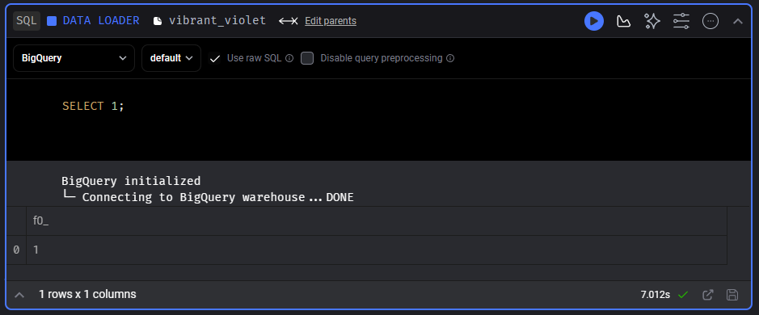
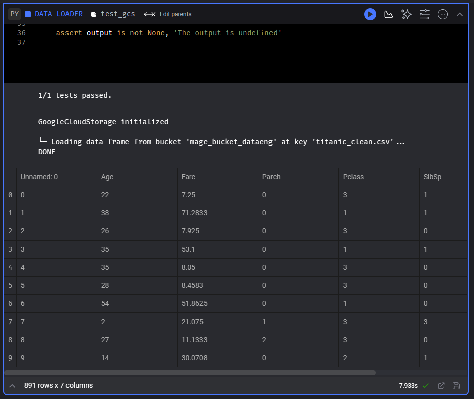
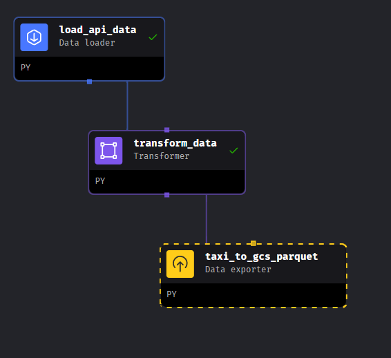
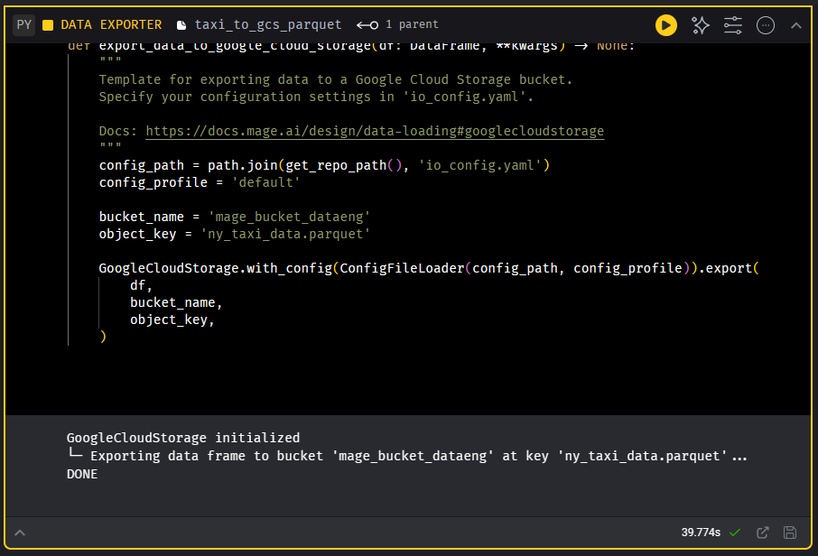
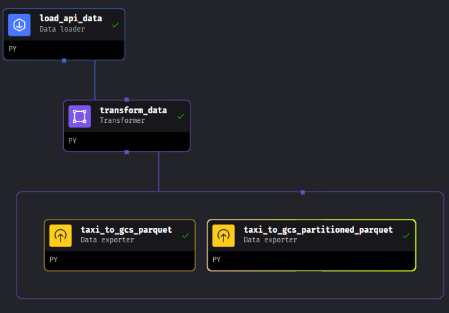
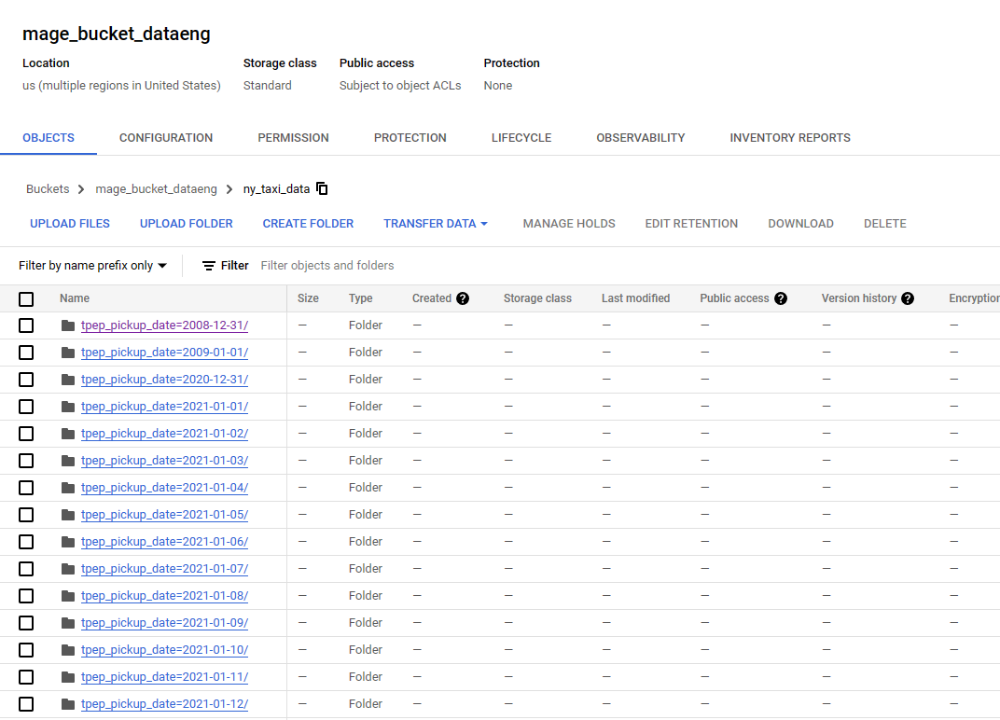

# 2.3. Working with GCP in Mage

## 2.3.1. Configuring GCP in Mage
[[Video Link]](https://www.youtube.com/watch?v=00LP360iYvE&list=PL3MmuxUbc_hJed7dXYoJw8DoCuVHhGEQb&index=23)

We will configure GCP access in Mage. We will use Google Cloud Storage (GCS) as an example.
- Create a new Service Account in GCP if you haven't already, generate a new key and download the JSON file. Copy the JSON file to the `mage-zoomcamp` directory.
- Create a GCS bucket and BigQuery Dataset in GCP Console. You can try to create it using Terraform as in the previous week's module.
- In Mage GUI > File, edit `io_config.yaml` file and replace the Google configuration with this:

```yaml
# Google
GOOGLE_SERVICE_ACC_KEY_FILEPATH: "/home/src/<your-service-account-key>.json"
GOOGLE_LOCATION: US # Optional
```

- Save the file and go to Pipeline, open `test_config` pipeline. Change the Connection to `BigQuery` and set the profile to `Default`. Run the block and check the output if the connection to the BigQuery is successful.



Now we will try loading a data from GCS through Mage. 
- Upload `titanic_clean.csv` file (located in `mage-zoomcamp` directory) to your GCS bucket via GCP Console.
- In Mage GUI, open `test_config` pipeline and create a new Data Loader block. Choose Python > Google Cloud Storage. Name it as `test_gcs`.
- Edit the `bucket_name` variable to your GCS bucket name and the `object_key` to `titanic_clean.csv`. Run the block and check the output. Succesful output will show like this:



## 2.3.2. Writing ETL pipeline: API to GCS
[[Video Link]](https://www.youtube.com/watch?v=w0XmcASRUnc&list=PL3MmuxUbc_hJed7dXYoJw8DoCuVHhGEQb&index=24)

We will create an ETL pipeline to load our NY taxi data to GCS through Mage. For this to work, we need to have the following blocks:
1. `Data Loader` block: to load the data from a source
2. `Data Transformer` block: to transform the data to a desired format (if any)
3. `Data Exporter` block: to export the transformed data to our GCS bucket

Something to note that we already have the `Data Loader` and `Data Transformer` block when we configure [ETL API to Postgres](./2_intro_to_mage.md#223-configuring-postgres-in-mage-and-etl-api-to-postgres). We will use the same blocks and then add the `Data Exporter` block in the end of the pipeline. 

- Create a new pipeline and name it as `api_to_gcs`.
- From the file explorer tab, in the `data_loaders` folder, drag and drop the `load_api_data.py` file to the pipeline. Do the same for the transfomer block `transform_data.py`. Connect the blocks in the order of `load_api_data` -> `transform_data`.
- Create a new Data Exporter block and choose Python > Google Cloud Storage. Name it as `export_to_gcs_parquet` (we will export our data to GCS as parquet file). Add connection from `transform_data` to `export_to_gcs_parquet` downstream. 



- Edit the Data Exporter block and replace the `bucket_name` to your GCS bucket name and replace the `object_key` value as `ny_taxi_data.parquet` (note on the file extension). 
- Run the pipeline and check the output.



_Note: If you are encountering `ConnectionError: ('Connection aborted.', TimeoutError('The write operation timed out'))`, this could be a network issue. Try changing your network to a faster internet speed._

- Check the GCS bucket if the `ny_taxi_data.parquet` file is successfully uploaded.

Next, we want to upload the same data to our bucket, but in a **partition** manner. There are a lot of benefits of partitioning data in GCS, such as faster query time and cost efficiency. We will partition the data by datetime because our data is saved as a time series data. We will use `pyarrow` library to do this automatically.

- In the same pipeline, create a new Data exporter > Python > Generic (no template) and give it `taxi_to_gcs_partitioned_parquet` name. Paste the following code:

```python
import pyarrow as pa 
import pyarrow.parquet as pq 
import os

if 'data_exporter' not in globals():
    from mage_ai.data_preparation.decorators import data_exporter

# Set the service account key file
os.environ["GOOGLE_APPLICATION_CREDENTIALS"] = "/home/src/<your_service_account>.json"

# Set the GCS bucket, project id, and table name
bucket_name = "your_bucket_name"
project_id = "your_project_id"

# Table name for the data in the bucket
table_name = "ny_taxi_data"

# Set the root path for the data in the bucket
# Because GCS bucket is just a filesystem, the partitioned data will be saved in a folder structure
root_path = f'{bucket_name}/{table_name}'

@data_exporter
def export_data(data, *args, **kwargs):
    # Convert the datetime column to datetime type
    data["tpep_pickup_date"] = data["tpep_pickup_datetime"].dt.date

    # Convert the pandas dataframe to pyarrow table
    table = pa.Table.from_pandas(data)

    # Initialize the GCS filesystem
    gcs = pa.fs.GcsFileSystem()

    # Write the table to the GCS bucket. We partition the data by the `tpep_pickup_date` column
    pq.write_to_dataset(
        table,
        root_path = root_path,
        partition_cols = ["tpep_pickup_date"],
        filesystem = gcs
    )
```

- Connect the data exporter block with the `transform_data` block.



- Run the pipeline and check the output. Check the GCS bucket if the data is successfully loaded. You should see there is `ny_taxi_data` folder and inside it, there are folders for each date. Each data folder contains the parquet file for that date. So if you want to query the data for a specific date, like `SELECT` for a specific date, it will just load the data from that specific folder, not the whole dataset. 

