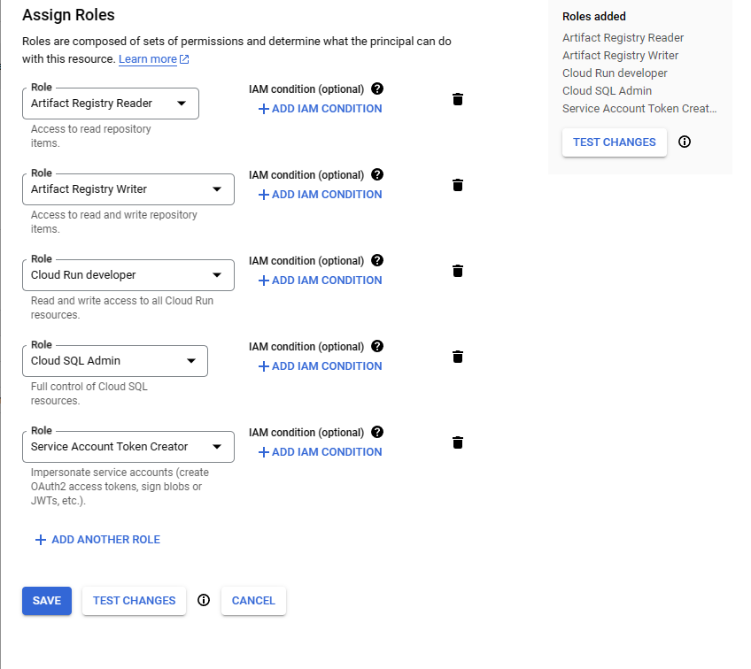
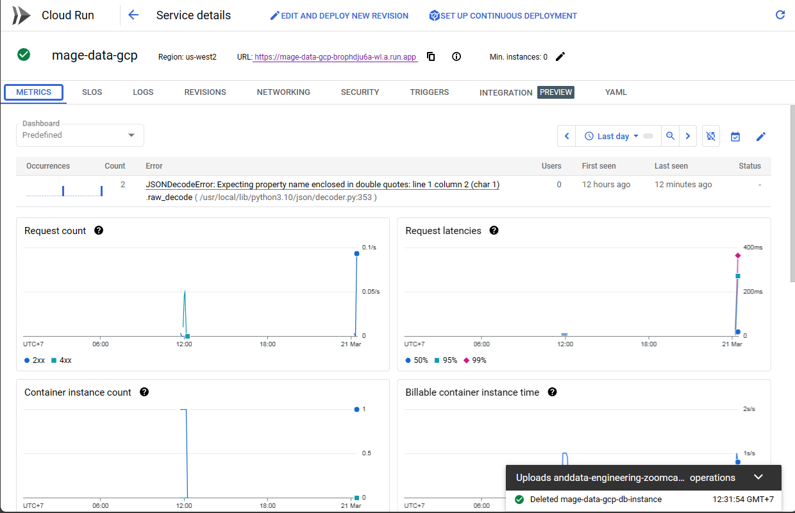
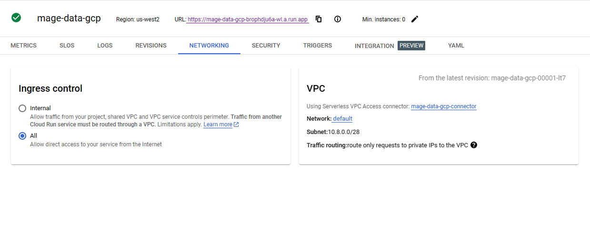
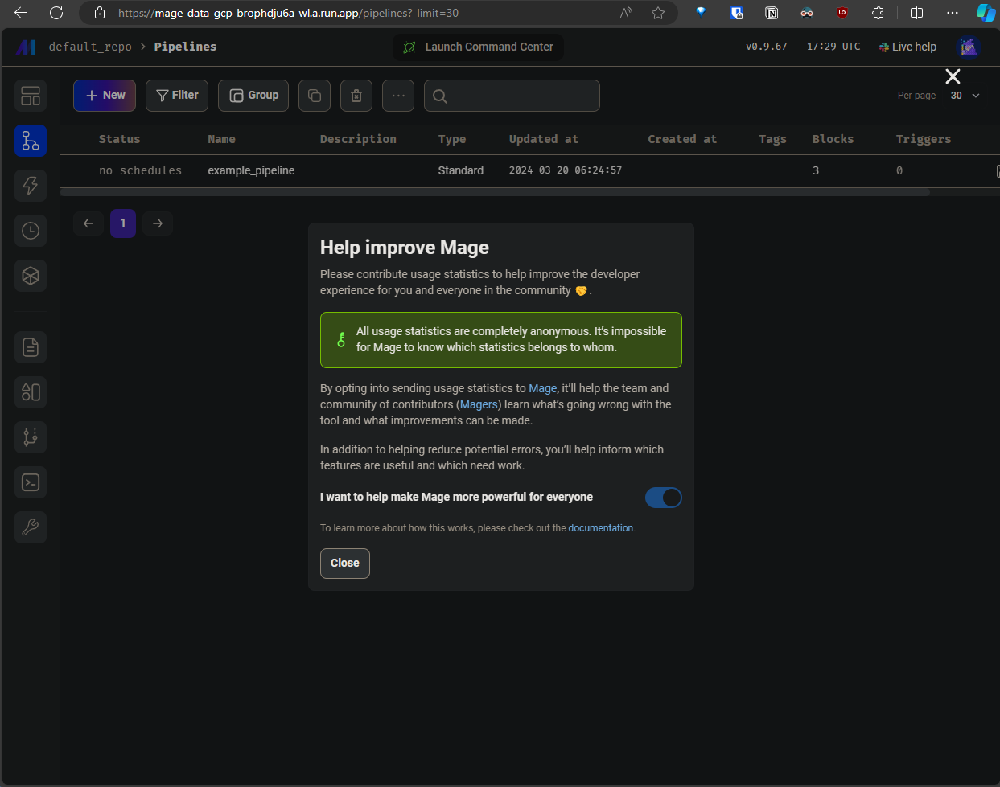

# 4. Deploying Mage To GCP

## Table of Contents
- [4.1. Prerequisites](#41-prerequisites)
- [4.2. Managing GCP Permissions and Enabling APIs](#42-managing-gcp-permissions-and-enabling-apis)
- [4.3. Deploying Mage to GCP](#43-deploying-mage-to-gcp)


Video links:
- [Prerequisites](https://www.youtube.com/watch?v=zAwAX5sxqsg&list=PL3MmuxUbc_hJed7dXYoJw8DoCuVHhGEQb&index=28&pp=iAQB)
- [Managing Permissions](https://www.youtube.com/watch?v=O_H7DCmq2rA&list=PL3MmuxUbc_hJed7dXYoJw8DoCuVHhGEQb&index=29&pp=iAQB)
- [Deploying - Part 1](https://www.youtube.com/watch?v=9A872B5hb_0&list=PL3MmuxUbc_hJed7dXYoJw8DoCuVHhGEQb&index=30&pp=iAQB)
- [Deploying - Part 2](https://www.youtube.com/watch?v=0YExsb2HgLI&list=PL3MmuxUbc_hJed7dXYoJw8DoCuVHhGEQb&index=31&pp=iAQB)

Step by step also available in Mage Docs [Here](https://docs.mage.ai/production/deploying-to-cloud/gcp/setup)

## 4.1. Prerequisites
- Make sure you have the followings installed in your system:
    1. Terraform
    2. gcloud CLI [installation](https://cloud.google.com/sdk/docs/install)

- Next, clone the [Mage Terraform scripts](https://github.com/mage-ai/mage-ai-terraform-templates) for GCP by using 
    ```bash
    git clone https://github.com/mage-ai/mage-ai-terraform-templates.git
    ```

## 4.2. Managing GCP Permissions and Enabling APIs

Go to the IAM management dashboard, find the service account associated to the account you just logged into, and then add these roles to that service account (e.g. choose your account as the principal when adding new roles):

- Artifact Registry Read
- Artifact Registy Writer
- Cloud Run Developer
- Cloud SQL Admin
- Service Account Token Creator

NOTE: It is recommended to remove the `Owner` role from the service account for best security practices.




Next, we need to enable the following APIs in the GCP console:
- Cloud SQL Admin API
- Cloud Filestore API
- Serverless VPC Access API

Search for the APIs in the search bar and enable them.

## 4.3. Deploying Mage to GCP

Before running any terraform command, we need to change some terraform configuration template part. 

- `cd` to the cloned repository, navigate to `variables.tf` in `gcp` folder. Edit the file and change the `default` value for the project id variable:

    ```terraform
    variable "project_id" {
    type        = string
    description = "The name of the project"
    default     = "your-gcp-project-id"
    }
    ```

    You can also change several variables if you want, such as:
    - Mage version in the docker image section
    - Application name
    - Region

- After that, we can start initializing the terraform by running the `terraform init` in the terminal in the `gcp` folder. 

    NOTE: make sure you have login to gcloud CLI by running `gcloud auth login` and select the account corresponding to the project id you are using.
- Run `terraform plan` to see the resources that will be created. Note: You will be prompted to enter password for Postgres database. 
- Run `terraform apply` to create the resources. The process will take a few minutes to complete. If it is successful, you will see the output of services ip created. 

    ```bash
    Apply complete! Resources: 21 added, 0 changed, 0 destroyed.

    Outputs:

    service_ip = "34.149.147.xx"
    ```
- Navigate to GCP Console and go to Cloud Run. You will see the deployed Mage service there. Click on the service to see more details. 

    

- In the service details, you will see URL for the Mage service. You can open the URL in the browser, but you will see that the service is 404 not found. This is because the service network is not yet connected to the internet. It only accessible from the internal through VPC. To make it accessible from the internet, navigate to `NETWORKING` tab and click `All` on `Ingress Control` section. 

    

- After that, you can open the URL in the browser and you will see the Mage service is up and running. 

    

- After you are done exploring and testing the service, you can destroy the resources simply by running `terraform destroy` in the terminal. 

## Notes
- For this tutorial, I am using the steps from the Youtube videos and some additional steps from other participants notes in the course. There is also steps from Mage docs and have some differences, such as configuring Secrets in Google Secret Manager and some additional troubleshooting steps.  

    NOTE: I've tried the steps from the Mage Docs, but got 403 error after created the resources. I've tried the solutions from the Mage docs but it's not working. I will try again later and update the notes if it's got resolved.